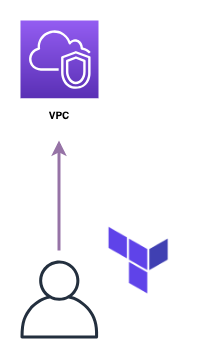
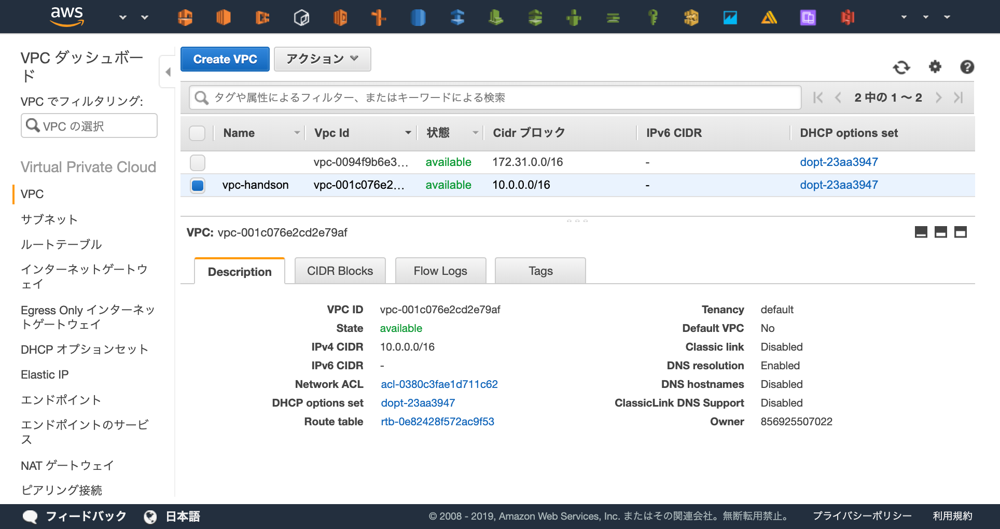

まずはTerraformを使ってみましょう。  
この章ではVPCの起動することを目標に、よく使用されるシンタックスを学んでいきます。

## 準備
新しいTerminalを立ち上げ、以下のコマンドでこの章用のディレクトリを作成し、作成したディレクトリに移動してください。  
```console
$ cd ~/Desktop/terraform-handson
$ mkdir vpc-handson
$ cd vpc-handson
```

Terraformを立ち上げているTerminalにもディレクトリが作成されていることを確認します。
```console
# ls
vpc-handson
```

## HCLを書く
VPCを立ち上げるためのコードを書きます。  
以下のコードを `main.tf` の命名で `vpc-handson/` 配下に作成してください。

```ruby
provider "aws" {
  region = "ap-northeast-1"
}

resource "aws_vpc" "main" {
  cidr_block = "10.0.0.0/16"

  tags = {
    Name = "vpc-handson"
  }
}
```

今回は `provider` と `resource` の2つを定義しました。

### provider
providerはその名の通りプロバイダの定義を行います。  
今回はAWSを使用したいため `aws` と宣言していますが、他にも `gcp` や `azure` など様々なプロバイダが用意されています。

また、providerブロック内で `region = "ap-northeast-1"` と定義しています。  
ここで指定したリージョンにVPCやEC2などの各種リソースを作成します。  
今回は"ap-northeast-1"(東京リージョン)を指定します。

### resource
resourceはVPCやEC2のような起動したいリソースを定義します。  
今回はコードへVPCを定義しました。これを実行することで **「vpc-handsonという名前でCIDRが10.0.0.0/16のVPC」** が作成されます。  

記述したコードがどのような意味を持つか、1つずつ見ていきましょう。

1行目から見ていきましょう。  

#### resourceの定義と命名
```ruby
resource "aws_vpc" "main" {
```
ここでは **「"aws_vpc"というリソースを"main"という名前」** で作成しています。  
`resource "aws_vpc"` まではAWSのVPCを作成するという意味で、 `"main"` はTerraformで定義する他のリソースから参照する際に使用します。

例として「VPCを作成し、作成したVPC内にSubnetを作成する」コードを載せます。
```ruby
# AWSプロバイダの定義
provider "aws" {
  region = "ap-northeast-1"
}

# VPCを作成する
resource "aws_vpc" "main" { # "main" という命名を行う
  cidr_block = "10.0.0.0/16"

  tags = {
    Name = "vpc-handson"
  }
}

# Subnetを作成する
resource "aws_subnet" "main" { # 別のリソースであれば命名が被っていても問題ないです
  vpc_id     = "${aws_vpc.main.id}" # aws_vpc.mainでmainと命名されたVPCを参照し、そのVPCのIDを取得する
  cidr_block = "10.0.1.0/24"
}
```

#### リソースのプロパティ
話を戻して、ブロック内のプロパティについて説明します。  
今回作成するVPCは以下の通り、「"vpc-handson"という名前を付け、CIDRを10.0.0.0/16に設定する」ように記述されています。
```ruby
  cidr_block = "10.0.0.0/16"

  tags = {
    Name = "vpc-handson"
  }
```

これはVPCやEC2などのリソース毎にプロパティが異なります。  
実際にTerraformのコードを記述する際はTerraformのリファレンスを見ながら記述していきます。

[AWS: aws_vpc - Terraform by HashiCorp](https://www.terraform.io/docs/providers/aws/r/vpc.html)

!!! note "Terraformリファレンスの先へ"
    TerraformはGolangでできており、AWSプロバイダはAWS SDK のAPIを叩いています。  
    実際にどのような値がどのようなバリデーションになっているのか、より詳細を知りたい場合はAWSのAPIリファレンスを見てみるのもありでしょう。  
    [CreateVpc - Amazon Elastic Compute Cloud](https://docs.aws.amazon.com/AWSEC2/latest/APIReference/API_CreateVpc.html)

## Terraformの実行
### 初期化
Terraformで新しく設定を記述した場合、初期化を行う必要があります。  
素のTerraformはプロバイダーが内部に組み込まれていないので、今回であればAWSプロバイダーのダウンロードが行われます。

初期化を行ってみましょう。
```console
# terraform init

Initializing provider plugins...
- Checking for available provider plugins on https://releases.hashicorp.com...
- Downloading plugin for provider "aws" (2.6.0)...

The following providers do not have any version constraints in configuration,
so the latest version was installed.

To prevent automatic upgrades to new major versions that may contain breaking
changes, it is recommended to add version = "..." constraints to the
corresponding provider blocks in configuration, with the constraint strings
suggested below.

* provider.aws: version = "~> 2.6"

Terraform has been successfully initialized!

You may now begin working with Terraform. Try running "terraform plan" to see
any changes that are required for your infrastructure. All Terraform commands
should now work.

If you ever set or change modules or backend configuration for Terraform,
rerun this command to reinitialize your working directory. If you forget, other
commands will detect it and remind you to do so if necessary.
```

### 適用
コードの状態をAWS上へ適用しましょう。
```console
# terraform apply

An execution plan has been generated and is shown below.
Resource actions are indicated with the following symbols:
  + create

Terraform will perform the following actions:

  + aws_vpc.main
      id:                               <computed>
      arn:                              <computed>
      assign_generated_ipv6_cidr_block: "false"
      cidr_block:                       "10.0.0.0/16"
      default_network_acl_id:           <computed>
      default_route_table_id:           <computed>
      default_security_group_id:        <computed>
      dhcp_options_id:                  <computed>
      enable_classiclink:               <computed>
      enable_classiclink_dns_support:   <computed>
      enable_dns_hostnames:             <computed>
      enable_dns_support:               "true"
      instance_tenancy:                 "default"
      ipv6_association_id:              <computed>
      ipv6_cidr_block:                  <computed>
      main_route_table_id:              <computed>
      owner_id:                         <computed>
      tags.%:                           "1"
      tags.Name:                        "vpc-handson"


Plan: 1 to add, 0 to change, 0 to destroy.

Do you want to perform these actions?
  Terraform will perform the actions described above.
  Only 'yes' will be accepted to approve.

  Enter a value:
```

> Plan: 1 to add, 0 to change, 0 to destroy.

新しく1つのリソースが追加されることが確認できました。  
ログを見て問題なければ `yes` で実行を継続しましょう

```console
  Enter a value: yes

aws_vpc.main: Creating...
  arn:                              "" => "<computed>"
  assign_generated_ipv6_cidr_block: "" => "false"
  cidr_block:                       "" => "10.0.0.0/16"
  default_network_acl_id:           "" => "<computed>"
  default_route_table_id:           "" => "<computed>"
  default_security_group_id:        "" => "<computed>"
  dhcp_options_id:                  "" => "<computed>"
  enable_classiclink:               "" => "<computed>"
  enable_classiclink_dns_support:   "" => "<computed>"
  enable_dns_hostnames:             "" => "<computed>"
  enable_dns_support:               "" => "true"
  instance_tenancy:                 "" => "default"
  ipv6_association_id:              "" => "<computed>"
  ipv6_cidr_block:                  "" => "<computed>"
  main_route_table_id:              "" => "<computed>"
  owner_id:                         "" => "<computed>"
  tags.%:                           "" => "1"
  tags.Name:                        "" => "vpc-handson"
aws_vpc.main: Creation complete after 7s (ID: vpc-028d784cfaa5ca479)

Apply complete! Resources: 1 added, 0 changed, 0 destroyed.
```

コンソールを確認して実際にVPCが起動できていることを確認してみましょう

[https://ap-northeast-1.console.aws.amazon.com/vpc/home?region=ap-northeast-1#vpcs:sort=desc:VpcId](https://ap-northeast-1.console.aws.amazon.com/vpc/home?region=ap-northeast-1#vpcs:sort=desc:VpcId)



### リソースの変更を行う
VPCの名前を "vpc-handson" から "vpc-handson-hoge" に変更してみましょう。  
`main.tf` を以下の通り編集し、VPCの命名を変更します。
```diff
provider "aws" {
  region = "ap-northeast-1"
}

resource "aws_vpc" "main" {
  cidr_block = "10.0.0.0/16"

  tags = {
-    Name = "vpc-handson"
+    Name = "vpc-handson-hoge"
  }
}
```

Terraformではコードを適用する前に、どのような変更がかかるのか確認(所謂dry-run)を行うことができます。  
実際にどのような変更がかかるのか確認してみましょう。

```console
# terraform plan
The refreshed state will be used to calculate this plan, but will not be
persisted to local or remote state storage.

aws_vpc.main: Refreshing state... (ID: vpc-001c076e2cd2e79af)

------------------------------------------------------------------------

An execution plan has been generated and is shown below.
Resource actions are indicated with the following symbols:
  ~ update in-place

Terraform will perform the following actions:

  ~ aws_vpc.main
      tags.Name: "vpc-handson" => "vpc-handson-hoge"


Plan: 0 to add, 1 to change, 0 to destroy.

------------------------------------------------------------------------

Note: You didn't specify an "-out" parameter to save this plan, so Terraform
can't guarantee that exactly these actions will be performed if
"terraform apply" is subsequently run.
```

変更の差分が検出でき、その差分を出力した後にコマンドが終了しました。  
Terraformを実行する際はオペミスを防ぐためにも `terraform apply` で実行する前に、 `terraform plan` でどのような変更がかかるのか確認してから実行するのが定石です。

どのような変更が行われるか検出できたので、実際に変更の適用を行いましょう。

```
# terraform apply
  :
```

適用が完了したらVPCのコンソールから変更が適用できたか確認してみましょう。


### Terraformが管理しているリソース
Terraformが管理しているリソースは `terraform show` コマンドで閲覧することが出来ます。

まずはコマンドを打って確認してみましょう。
```
# terraform show
aws_vpc.main:
  id = vpc-07be0a5e024877c48
  arn = arn:aws:ec2:ap-northeast-1:856925507022:vpc/vpc-07be0a5e024877c48
  assign_generated_ipv6_cidr_block = false
  cidr_block = 10.0.0.0/16
  default_network_acl_id = acl-0a00c5fa26f28e853
  default_route_table_id = rtb-0681966791d3ad652
  default_security_group_id = sg-0a5a4b4a19b9d4240
  dhcp_options_id = dopt-23aa3947
  enable_classiclink = false
  enable_classiclink_dns_support = false
  enable_dns_hostnames = false
  enable_dns_support = true
  instance_tenancy = default
  ipv6_association_id =
  ipv6_cidr_block =
  main_route_table_id = rtb-0681966791d3ad652
  owner_id = 856925507022
  tags.% = 1
  tags.Name = vpc-handson-hoge
```

Terraformが管理しているリソースは `terraform.tfstate` というJSONファイルに格納されます。  
Terraformコードの適用を行う際はこのファイルを参照し、差分の確認を行っています。

```console
# ls
main.tf                  terraform.tfstate        terraform.tfstate.backup
# cat terraform.tfstate
{
    "version": 3,
    "terraform_version": "0.11.13",
    "serial": 5,
    "lineage": "40f395d7-8d59-b14c-f92f-e836258630af",
    "modules": [
        {
            "path": [
                "root"
            ],
```

Terraformは **インフラをコードで宣言する** ためのツールです。  
そのため、コードで定義された状態になるように動作します。

現在のapplyが完了した状態で `terraform plan` コマンドを打っても差分が検出されないことを確認しましょう
```console
# terraform plan
```

!!! note "terraform.tfstateをクラウドで管理する"
    前提として `terraform.tfstate` をローカル上で管理するのは危険です。  
    Terraformはこのファイルを参照してコードの状態を適用するので、このファイルが存在しないと差分が検知できずに新しくリソースが作成されてしまいます。  
    もし「ローカルマシンが壊れた場合」「複数人で開発したい場合」など、プロダクション開発で使用する場合はバックアップを行う必要があります。  
    そのバックアップの機能としてTerraformは "backend" という `terraform.tfstate` をS3などのオブジェクトストレージに保管する機能が存在するので、本番でTerraformを使用する場合は検討しましょう。

## 削除する
Terraformで管理されているリソースを削除しましょう。  
ワンコマンドで管理しているリソースを削除できます。  

実際に削除してみましょう。
```console
# terraform destroy
aws_vpc.main: Refreshing state... (ID: vpc-001c076e2cd2e79af)

An execution plan has been generated and is shown below.
Resource actions are indicated with the following symbols:
  - destroy

Terraform will perform the following actions:

  - aws_vpc.main


Plan: 0 to add, 0 to change, 1 to destroy.

Do you really want to destroy all resources?
  Terraform will destroy all your managed infrastructure, as shown above.
  There is no undo. Only 'yes' will be accepted to confirm.

  Enter a value: 
```

削除を実行するか確認がでるので、問題なければ `yes` と入力します

```console
  Enter a value: yes

aws_vpc.main: Destroying... (ID: vpc-001c076e2cd2e79af)
aws_vpc.main: Destruction complete after 1s

Destroy complete! Resources: 1 destroyed.
```

WebコンソールでTerraformで作成したVPCが削除されていることを確認しましょう。
