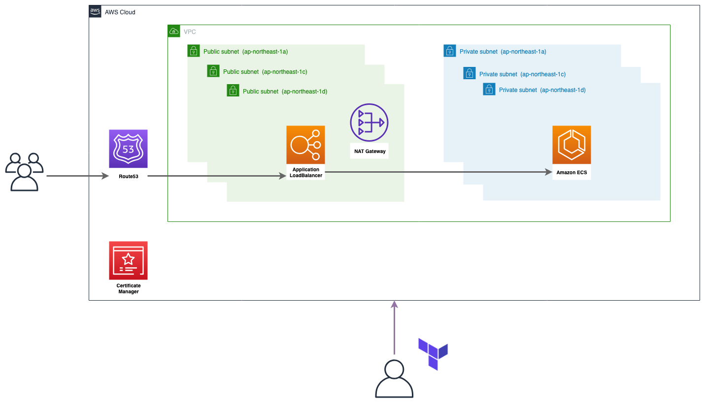

## 目標

上記の画像が今回のハンズオンで構築を行う構成図になります。  
目標としているのは「nginxの起動とそのhttps化」です。

TODO: このハンズオンの章が完成したgithub

## 使用するサービスと用途
ハンズオンで構築するリソースについて概要を説明します。

### Route 53
- Hosted Zone
    - ドメインのレコードの管理

### ACM
- Certificate
    - AWSでTLS証明書の発行/管理を行う。

### VPC
- VPC
    - AWS上へ仮想的なネットワークを作成する
- Subnet
    - VPC上へ小規模な仮想的なネットワークを作成する
    - 今回はPublic SubnetとPrivate Subnetの2種類を3個ずつ(AZ分)作成する。
- Internet Gateway
    - VPCはデフォルトだとIN/OUTともにインターネットへの疎通は行えないため、インターネットへの出入り口を作るリソース
- Route Table
    - ネットワークの経路情報を設定するためのサービス
    - Subnetはデフォルトだとインターネットへ疎通できないため、Route Table でSubnetとInternet Gatewayを紐づけて疎通を可能にする必要がある
- NAT Gateway
    - Private Subnetをインターネットへ疎通

!!! note "Private Subnet と Public Subnet の違い"
    インターネットとの相互的な経路を設定されたSubnetをPublic Subnetと呼び、インターネットへの経路を設定していないSubnetをPrivate Subnetと呼びます。  
    インターネットへの経路の設定の仕方はSubnetをRouteTableでInternet Gateway と紐付けることで実現します。  
    使い分けは単純で、外部に公開するもの(ロードバランサや踏み台)はPublic Subnetで、公開しないもの(Web/AppサーバやDB)はPrivate Subnetへ配置します。

### EC2
- Application Load Balancer
    - L7ロードバランサ
    - 受け取ったトラフィックを紐付けられているTarget Group で管理されているサーバーへ渡す
- Target Group
    - ロードバランサ配下のサーバーの管理

### ECS
- Task Definition
    - コンテナの定義
- Service
    - Task Definitionで定義されたコンテナを動かす
    - 動かしたコンテナをロードバランサへ紐付ける
