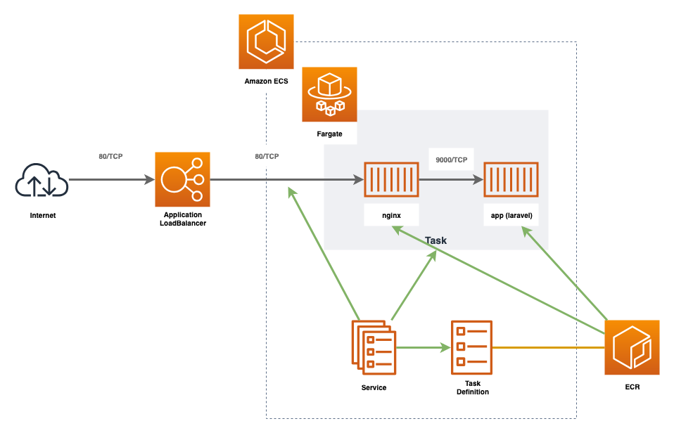

## この章の目標


この章ではLaravelの起動を目標にします

## リソース
- ECS Service
- Task Definition
- IAM Role
- Cloud Watch Log Group
- Security Group

## コード
長くなりますが、コードを記載します。

```ruby
variable "name" {
  type = "string"
}

variable "vpc_id" {
  type = "string"
}

variable "https_listener_arn" {
  type = "string"
}

variable "cluster_name" {
  type = "string"
}

variable "subnet_ids" {
  type = "list"
}

variable "db_host" {
  type = "string"
}

variable "db_username" {
  type = "string"
}

variable "db_password" {
  type = "string"
}

variable "db_database" {
  type = "string"
}

variable "app_key" {
  type = "string"
}

data "aws_region" "current" {}

data "aws_caller_identity" "current" {}

locals {
  name = "${var.name}-laravel"

  # アカウントID
  account_id = "${data.aws_caller_identity.current.account_id}"

  # プロビジョニングを実行するリージョン
  region = "${data.aws_region.current.name}"
}

resource "aws_lb_target_group" "this" {
  name = "${local.name}"

  vpc_id = "${var.vpc_id}"

  port        = 80
  target_type = "ip"
  protocol    = "HTTP"

  health_check = {
    port = 80
  }
}

data "template_file" "container_definitions" {
  template = "${file("./ecs_laravel/container_definitions.json")}"

  vars = {
    tag = "latest"

    account_id = "${local.account_id}"
    region     = "${local.region}"
    name       = "${local.name}"

    db_host     = "${var.db_host}"
    db_username = "${var.db_username}"
    db_password = "${var.db_password}"
    db_database = "${var.db_database}"

    app_key = "${var.app_key}"
  }
}

resource "aws_ecs_task_definition" "this" {
  family = "${local.name}"

  container_definitions = "${data.template_file.container_definitions.rendered}"

  cpu                      = "256"
  memory                   = "512"
  network_mode             = "awsvpc"
  requires_compatibilities = ["FARGATE"]

  task_role_arn      = "${aws_iam_role.task_execution.arn}"
  execution_role_arn = "${aws_iam_role.task_execution.arn}"
}

resource "aws_cloudwatch_log_group" "this" {
  name              = "/${var.name}/ecs"
  retention_in_days = "7"
}

resource "aws_iam_role" "task_execution" {
  name = "${var.name}-TaskExecution"

  assume_role_policy = <<EOF
{
  "Version": "2012-10-17",
  "Statement": [
    {
      "Action": "sts:AssumeRole",
      "Principal": {
        "Service": "ecs-tasks.amazonaws.com"
      },
      "Effect": "Allow",
      "Sid": ""
    }
  ]
}
EOF
}

resource "aws_iam_role_policy" "task_execution" {
  role = "${aws_iam_role.task_execution.id}"

  policy = <<EOF
{
  "Version": "2012-10-17",
  "Statement": [
    {
      "Action": [
        "logs:CreateLogGroup",
        "logs:CreateLogStream",
        "logs:PutLogEvents",
        "logs:DescribeLogGroups",
        "logs:DescribeLogStreams"
      ],
      "Effect": "Allow",
      "Resource": "*"
    }
  ]
}
EOF
}

resource "aws_iam_role_policy_attachment" "task_execution" {
  role       = "${aws_iam_role.task_execution.name}"
  policy_arn = "arn:aws:iam::aws:policy/service-role/AmazonECSTaskExecutionRolePolicy"
}

resource "aws_lb_listener_rule" "this" {
  listener_arn = "${var.https_listener_arn}"

  action {
    type             = "forward"
    target_group_arn = "${aws_lb_target_group.this.id}"
  }

  condition {
    field  = "path-pattern"
    values = ["*"]
  }
}

resource "aws_security_group" "this" {
  name        = "${local.name}"
  description = "${local.name}"

  vpc_id = "${var.vpc_id}"

  egress {
    from_port   = 0
    to_port     = 0
    protocol    = "-1"
    cidr_blocks = ["0.0.0.0/0"]
  }

  tags = {
    Name = "${local.name}"
  }
}

resource "aws_security_group_rule" "this_http" {
  security_group_id = "${aws_security_group.this.id}"

  type = "ingress"

  from_port   = 80
  to_port     = 80
  protocol    = "tcp"
  cidr_blocks = ["0.0.0.0/0"]
}

resource "aws_ecs_service" "this" {
  depends_on = ["aws_lb_listener_rule.this"]

  name = "${local.name}"

  launch_type = "FARGATE"

  desired_count = 1

  cluster = "${var.cluster_name}"

  task_definition = "${aws_ecs_task_definition.this.arn}"

  network_configuration = {
    subnets         = ["${var.subnet_ids}"]
    security_groups = ["${aws_security_group.this.id}"]
  }

  load_balancer = [
    {
      target_group_arn = "${aws_lb_target_group.this.arn}"
      container_name   = "nginx"
      container_port   = "80"
    },
  ]
}
```

## 動作確認
実際にドメインにアクセスし、Laravelの画面が表示されれば成功です
